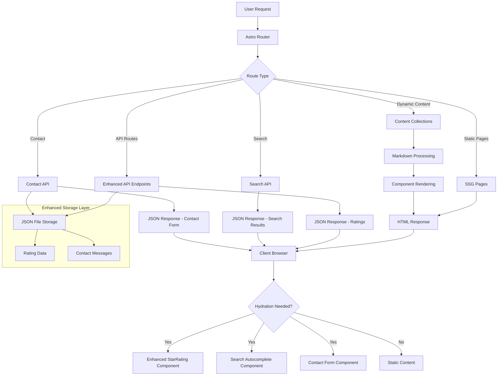

# Design Document

## Overview

This design document outlines the technical implementation for enhancing the existing Arabic Q&A website with improved API functionality, contact form, enhanced rating system, and intelligent search capabilities. The enhancements will integrate seamlessly with the existing Astro-based architecture while adding new interactive features.

The design maintains the existing performance-first approach, using minimal client-side JavaScript and leveraging Astro's server-side rendering capabilities. New features will follow the established patterns of selective hydration and component-based architecture.

## Architecture

### Enhanced System Architecture



### New Components Integration

The enhanced system will add three main interactive components:

1. **Enhanced StarRating Component** - Allow rating updates
2. **SearchBanner Component** - Intelligent search with autocomplete
3. **ContactForm Component** - User communication interface

## Components and Interfaces

### Enhanced StarRating Component

```typescript
interface EnhancedStarRatingProps {
  slug: string;
  initialRating?: number; // Load existing user rating
}

interface RatingData {
  slug: string;
  ratings: { [userId: string]: number };
  average: number;
  count: number;
}
```

**Features:**
- Load existing user rating on component mount
- Allow rating updates with visual feedback
- Show current average and vote count
- Persist to both localStorage and server

### SearchBanner Component

```typescript
interface SearchBannerProps {
  placeholder?: string;
  maxSuggestions?: number;
}

interface SearchSuggestion {
  slug: string;
  question: string;
  shortAnswer: string;
  tags: string[];
}

interface SearchResult {
  suggestions: SearchSuggestion[];
  hasMore: boolean;
}
```

**Features:**
- Real-time autocomplete with debounced API calls
- Keyboard navigation (arrow keys, enter, escape)
- Click-to-select functionality
- Mobile-responsive dropdown
- RTL-aware text highlighting

### ContactForm Component

```typescript
interface ContactFormProps {
  successMessage?: string;
  errorMessage?: string;
}

interface ContactFormData {
  name: string;
  email: string;
  subject: string;
  message: string;
  timestamp: Date;
  id: string;
}
```

**Features:**
- Form validation with Arabic error messages
- Email format validation
- Required field validation
- Success/error state management
- Accessibility with proper ARIA labels

## Data Models

### Enhanced Rating System

```typescript
// File: data/ratings.json
interface RatingStorage {
  [questionSlug: string]: {
    ratings: { [userId: string]: number };
    average: number;
    count: number;
    lastUpdated: Date;
  };
}

// User identification strategy
interface UserIdentifier {
  id: string; // Generated from IP + User-Agent hash for privacy
  lastSeen: Date;
}
```

### Contact Form Storage

```typescript
// File: data/contacts.json
interface ContactStorage {
  messages: ContactFormData[];
  lastId: number;
}
```

### Search Index

```typescript
// File: data/search-index.json
interface SearchIndex {
  questions: {
    slug: string;
    question: string;
    shortAnswer: string;
    content: string; // First 200 chars for search
    tags: string[];
    searchTerms: string[]; // Processed search terms
  }[];
  lastUpdated: Date;
}
```

## Error Handling

### Enhanced API Error Handling

```typescript
// Enhanced Rating API (POST /api/rate)
export async function POST({ request, url }) {
  try {
    const slug = url.searchParams.get('slug');
    const body = await request.json();
    const { rating, userId } = body;

    // Validation
    if (!slug || !userId || rating < 1 || rating > 5) {
      return new Response(
        JSON.stringify({ 
          ok: false, 
          message: 'معاملات غير صحيحة' // Invalid parameters in Arabic
        }),
        { status: 400, headers: { 'Content-Type': 'application/json' } }
      );
    }

    // Load existing ratings
    const ratingsData = await loadRatings();
    
    // Update or add rating
    if (!ratingsData[slug]) {
      ratingsData[slug] = { ratings: {}, average: 0, count: 0, lastUpdated: new Date() };
    }
    
    ratingsData[slug].ratings[userId] = rating;
    
    // Recalculate average
    const ratings = Object.values(ratingsData[slug].ratings);
    ratingsData[slug].average = ratings.reduce((a, b) => a + b, 0) / ratings.length;
    ratingsData[slug].count = ratings.length;
    ratingsData[slug].lastUpdated = new Date();
    
    // Save to file
    await saveRatings(ratingsData);
    
    return new Response(
      JSON.stringify({ 
        ok: true, 
        average: ratingsData[slug].average,
        count: ratingsData[slug].count,
        userRating: rating
      }),
      { headers: { 'Content-Type': 'application/json' } }
    );
    
  } catch (error) {
    console.error('Rating API error:', error);
    return new Response(
      JSON.stringify({ ok: false, message: 'خطأ في الخادم' }), // Server error in Arabic
      { status: 500, headers: { 'Content-Type': 'application/json' } }
    );
  }
}

// Search API (GET /api/search)
export async function GET({ url }) {
  try {
    const query = url.searchParams.get('q');
    if (!query || query.length < 2) {
      return new Response(
        JSON.stringify({ suggestions: [] }),
        { headers: { 'Content-Type': 'application/json' } }
      );
    }

    const searchIndex = await loadSearchIndex();
    const suggestions = searchIndex.questions
      .filter(q => 
        q.question.toLowerCase().includes(query.toLowerCase()) ||
        q.shortAnswer.toLowerCase().includes(query.toLowerCase()) ||
        q.tags.some(tag => tag.toLowerCase().includes(query.toLowerCase()))
      )
      .slice(0, 5)
      .map(q => ({
        slug: q.slug,
        question: q.question,
        shortAnswer: q.shortAnswer,
        tags: q.tags
      }));

    return new Response(
      JSON.stringify({ suggestions }),
      { 
        headers: { 
          'Content-Type': 'application/json',
          'Cache-Control': 'public, max-age=300' // 5 minutes cache
        } 
      }
    );
    
  } catch (error) {
    console.error('Search API error:', error);
    return new Response(
      JSON.stringify({ suggestions: [] }),
      { status: 500, headers: { 'Content-Type': 'application/json' } }
    );
  }
}

// Contact API (POST /api/contact)
export async function POST({ request }) {
  try {
    const body = await request.json();
    const { name, email, subject, message } = body;

    // Validation
    if (!name || !email || !subject || !message) {
      return new Response(
        JSON.stringify({ 
          ok: false, 
          message: 'جميع الحقول مطلوبة' // All fields required in Arabic
        }),
        { status: 400, headers: { 'Content-Type': 'application/json' } }
      );
    }

    // Email validation
    const emailRegex = /^[^\s@]+@[^\s@]+\.[^\s@]+$/;
    if (!emailRegex.test(email)) {
      return new Response(
        JSON.stringify({ 
          ok: false, 
          message: 'عنوان البريد الإلكتروني غير صحيح' // Invalid email in Arabic
        }),
        { status: 400, headers: { 'Content-Type': 'application/json' } }
      );
    }

    // Save contact message
    const contactData: ContactFormData = {
      name,
      email,
      subject,
      message,
      timestamp: new Date(),
      id: generateId()
    };

    await saveContactMessage(contactData);

    return new Response(
      JSON.stringify({ 
        ok: true, 
        message: 'تم إرسال رسالتك بنجاح' // Message sent successfully in Arabic
      }),
      { headers: { 'Content-Type': 'application/json' } }
    );
    
  } catch (error) {
    console.error('Contact API error:', error);
    return new Response(
      JSON.stringify({ 
        ok: false, 
        message: 'خطأ في إرسال الرسالة' // Error sending message in Arabic
      }),
      { status: 500, headers: { 'Content-Type': 'application/json' } }
    );
  }
}
```

## Testing Strategy

### API Testing

- Test rating submission and updates
- Verify search autocomplete functionality
- Test contact form submission and validation
- Test error handling for all endpoints

### Component Testing

- StarRating component rating updates
- SearchBanner autocomplete and navigation
- ContactForm validation and submission
- Mobile responsiveness for all new components

### Integration Testing

- Search integration with existing content
- Rating system integration with question pages
- Contact form integration with site layout
- Dark mode compatibility for all new features

## Performance Optimizations

### Search Performance

- Debounced search requests (300ms delay)
- Cached search index loaded once at build time
- Limited autocomplete results (5 suggestions max)
- Client-side caching of recent searches

### Rating System Performance

- Batch rating updates to reduce file I/O
- Cached average calculations
- Optimistic UI updates with rollback on error

### Bundle Size Optimization

- Lazy load search component only when needed
- Minimal JavaScript for contact form validation
- Reuse existing utility functions and styles

## Security Considerations

### Input Validation

- Sanitize all user inputs
- Rate limiting for API endpoints
- CSRF protection for form submissions

### Data Privacy

- Hash user identifiers for rating system
- No personal data stored in ratings
- Contact form data stored securely

### API Security

- Input validation on all endpoints
- Proper error messages without exposing internals
- File system access controls for data storage

## Deployment Configuration

### File System Structure

```
data/
├── ratings.json          # Rating storage
├── contacts.json         # Contact messages
└── search-index.json     # Search index
```

### Environment Variables

- `CONTACT_EMAIL`: Admin email for contact notifications
- `RATE_LIMIT_WINDOW`: API rate limiting window
- `SEARCH_CACHE_TTL`: Search cache time-to-live

This design provides a comprehensive enhancement to the existing Arabic Q&A site while maintaining performance, accessibility, and the established architectural patterns.