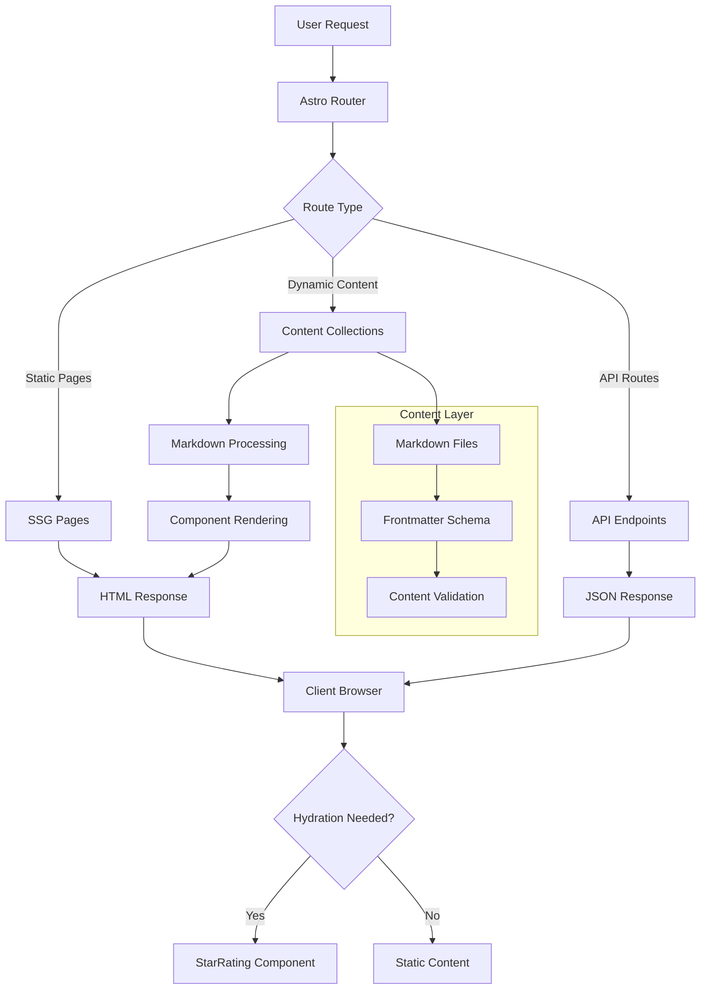
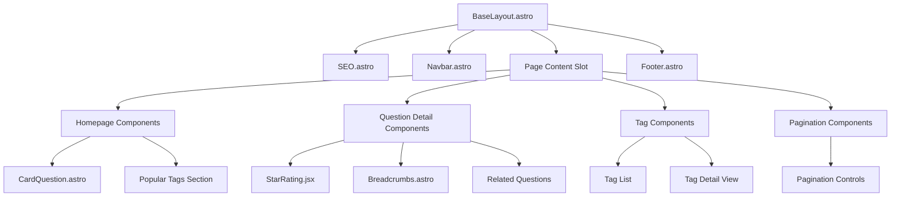
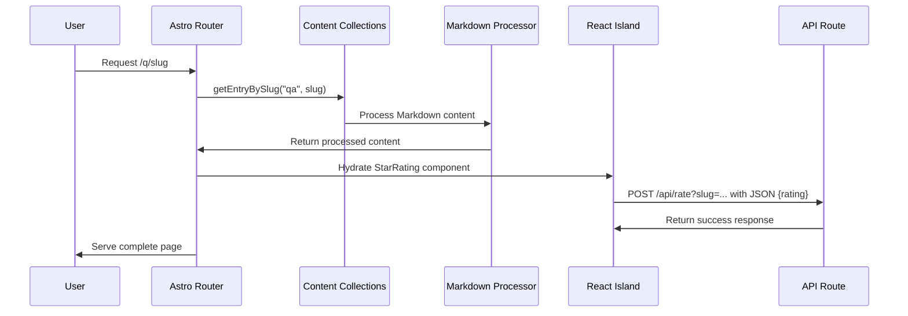

# Design Document

## Overview

This design document outlines the technical architecture for a production-ready Arabic Q&A website built with Astro and Tailwind CSS. The site leverages Astro's static site generation capabilities with selective hydration for interactive components, ensuring optimal performance while maintaining rich user interactions.

The architecture follows a content-first approach using Astro's Content Collections API for structured content management, with a focus on SEO optimization, accessibility, and RTL language support. The design emphasizes minimal JavaScript usage, loading client-side code only where necessary (rating component) while maintaining server-side rendering for all content pages.

## Architecture

### High-Level Architecture



### Technology Stack

- **Framework**: Astro 4.x with TypeScript
- **Styling**: Tailwind CSS with custom configuration
- **Content Management**: Astro Content Collections with Zod validation
- **Client-Side Interactivity**: React (StarRating component only)
- **SEO**: @astrojs/sitemap integration
- **Build Tool**: Vite (built into Astro)
- **Package Manager**: npm

### Deployment Architecture

The site is designed for server/edge deployment on Vercel with the following characteristics:

- Pages pre-rendered at build time where possible (SSG)
- Serverless API routes for rating functionality
- CDN-friendly with proper caching headers
- Optimized for Vercel serverless deployment

## Components and Interfaces

### Core Component Hierarchy



### Component Specifications

#### BaseLayout.astro

- **Purpose**: Root layout component providing consistent structure
- **Props**: `title?: string, description?: string, noindex?: boolean`
- **Features**:
  - HTML lang="ar" dir="rtl" attributes
  - Responsive container with max-w-3xl
  - Global header/footer integration
  - SEO component integration

#### SEO.astro

- **Purpose**: Centralized SEO meta tag management
- **Props**: `title: string, description: string, ogImage?: string, canonical?: string, noindex?: boolean`
- **Features**:
  - Automatic canonical URL generation
  - Open Graph and Twitter Card meta tags
  - Structured data injection point
  - Conditional noindex support

#### StarRating.jsx (React Island)

- **Purpose**: Interactive 5-star rating component
- **Props**: `slug: string`
- **Features**:
  - Keyboard accessible (Tab navigation, Enter/Space activation)
  - localStorage persistence with key format: `rating:${slug}`
  - API integration for rating submission
  - Visual feedback for hover and selected states
  - ARIA labels for screen readers

#### CardQuestion.astro

- **Purpose**: Reusable question card for listings
- **Props**: `href: string, title: string, description: string, date: Date, tags: string[]`
- **Features**:
  - Hover elevation effects
  - Tag pills with proper spacing
  - Responsive design
  - RTL-friendly layout

### Interface Definitions

```typescript
// Content Collection Schema
interface QAEntry {
  question: string;
  shortAnswer: string; // max 155 characters for SEO optimization
  pubDate: Date;
  updatedDate?: Date;
  tags: string[];
  difficulty: 'easy' | 'medium' | 'hard';
  heroImage?: string;
}

// Pagination Interface
interface PaginationResult<T> {
  page: number;
  pages: number;
  total: number;
  items: T[];
  hasNext: boolean;
  hasPrev: boolean;
}

// API Response Interfaces
interface RatingResponse {
  ok: boolean;
  message?: string;
}

interface AverageRatingResponse {
  avg: number | null;
  count?: number;
}
```

## Data Models

### Content Collection Schema

The content collection uses Zod for runtime validation and TypeScript type generation:

```typescript
import { defineCollection, z } from 'astro:content';

const qa = defineCollection({
  type: 'content',
  schema: z.object({
    question: z.string().min(10).max(200),
    shortAnswer: z.string().min(20).max(155), // SEO-optimized length for meta descriptions
    pubDate: z.date(),
    updatedDate: z.date().optional(),
    tags: z.array(z.string()).default([]),
    difficulty: z.enum(['easy', 'medium', 'hard']).default('easy'),
    heroImage: z.string().optional(),
  }),
});
```

### File Structure

```
src/content/qa/
├── what-is-astro.md
├── when-to-use-astro.md
└── seo-for-qa-sites.md
```

Each Markdown file contains:

- YAML frontmatter with schema-validated metadata
- Markdown content for detailed answers
- Optional hero images in `public/images/` directory

### Data Flow



## Error Handling

### Content Validation

- Zod schema validation at build time
- Graceful handling of missing content files
- Automatic redirect to homepage for 404s

### API Error Handling

```typescript
// Rating API error handling (POST /api/rate)
export async function POST({ request, url }) {
  try {
    const slug = url.searchParams.get('slug');
    const body = await request.json();
    const rating = body.rating;

    if (!slug || rating < 1 || rating > 5) {
      return new Response(
        JSON.stringify({ ok: false, message: 'Invalid parameters' }),
        {
          status: 400,
          headers: { 'Content-Type': 'application/json' },
        }
      );
    }
    // Process rating...
    return new Response(JSON.stringify({ ok: true }), {
      headers: { 'Content-Type': 'application/json' },
    });
  } catch (error) {
    return new Response(
      JSON.stringify({ ok: false, message: 'Server error' }),
      {
        status: 500,
        headers: { 'Content-Type': 'application/json' },
      }
    );
  }
}

// Average rating API (GET /api/avg)
export async function GET({ url }) {
  try {
    const slug = url.searchParams.get('slug');
    if (!slug) {
      return new Response(JSON.stringify({ avg: null }), {
        status: 400,
        headers: { 'Content-Type': 'application/json' },
      });
    }
    // Fetch average from database...
    return new Response(JSON.stringify({ avg: null }), {
      headers: {
        'Content-Type': 'application/json',
        'Cache-Control': 'public, max-age=300',
      },
    });
  } catch (error) {
    return new Response(JSON.stringify({ avg: null }), {
      status: 500,
      headers: { 'Content-Type': 'application/json' },
    });
  }
}
```

### Client-Side Error Handling

- StarRating component handles API failures gracefully
- localStorage errors caught and logged
- Fallback UI states for network issues

## Testing Strategy

### Build-Time Validation

- Content schema validation via Zod
- TypeScript type checking
- ESLint and Prettier for code quality

### Manual Testing Checklist

- Homepage displays latest 6 questions and popular tags
- Question detail pages show all required elements
- Rating component persists to localStorage and calls API
- Tag pages filter content correctly
- Pagination works with proper navigation
- RSS feed generates with correct format
- Sitemap includes all pages
- Dark mode toggles properly
- RTL layout displays correctly
- Accessibility: keyboard navigation, screen reader support
- Performance: Lighthouse scores ≥ 90 for Performance and SEO

### Browser Testing

- Chrome, Firefox, Safari, Edge
- Mobile responsive design
- Touch interactions for rating component
- Keyboard-only navigation

## Performance Optimizations

### Build-Time Optimizations

- Static site generation for all content pages
- Automatic code splitting by Astro
- CSS purging via Tailwind
- Image optimization for hero images

### Runtime Optimizations

- Minimal JavaScript: only StarRating component hydrated
- `client:visible` directive for lazy hydration
- Proper image sizing to prevent CLS
- Lazy loading for below-the-fold images

### Caching Strategy

```typescript
// Average rating API with caching (GET /api/avg)
export async function GET({ url }) {
  const slug = url.searchParams.get('slug');
  // Fetch average rating data...
  return new Response(JSON.stringify({ avg: 4.2, count: 15 }), {
    headers: {
      'Content-Type': 'application/json',
      'Cache-Control': 'public, max-age=300', // 5 minutes for average ratings
    },
  });
}

// Rating submission API (POST /api/rate) - no caching
export async function POST({ request, url }) {
  // Handle rating submission...
  return new Response(JSON.stringify({ ok: true }), {
    headers: {
      'Content-Type': 'application/json',
      // No cache headers for POST operations
    },
  });
}
```

### Bundle Analysis

- Expected JavaScript bundle: < 50KB (StarRating component only)
- CSS bundle: Tailwind utilities only (purged)
- No external dependencies loaded globally

## SEO and Accessibility

### SEO Implementation

- Semantic HTML structure with proper heading hierarchy
- Meta descriptions under 160 characters
- Open Graph and Twitter Card meta tags
- Structured data for FAQPage and BlogPosting
- XML sitemap generation via @astrojs/sitemap
- robots.txt file explicitly referencing /sitemap-index.xml at the exact path generated by @astrojs/sitemap
- RSS feed for content syndication
- Canonical URLs to prevent duplicate content (including self-canonical for paginated pages)

### Accessibility Features

- ARIA labels on interactive elements
- Keyboard navigation support
- Focus indicators with proper contrast
- Screen reader friendly content structure
- Color contrast ratios meeting WCAG AA standards
- Alternative text for images

### RTL Language Support

- `dir="rtl"` attribute on HTML element
- `lang="ar"` for proper language declaration
- RTL-aware Tailwind utilities
- Proper text alignment and spacing
- Icon and layout adjustments for RTL reading

## Security Considerations

### Input Validation

- Zod schema validation for all content
- API parameter validation
- XSS prevention through proper escaping

### API Security

- Rate limiting considerations for rating API
- Input sanitization
- CORS headers if needed for external access

## Deployment Configuration

### Vercel Deployment

```typescript
// astro.config.mjs
import { defineConfig } from 'astro/config';
import tailwind from '@astrojs/tailwind';
import sitemap from '@astrojs/sitemap';
import vercel from '@astrojs/vercel/serverless';

export default defineConfig({
  site: 'https://example.com', // Update for production
  integrations: [tailwind(), sitemap()],
  trailingSlash: 'never',
  output: 'server', // Enable server-side rendering for API routes
  adapter: vercel(), // Use Vercel adapter for deployment
});
```

### Environment Variables

- `SITE_URL`: Production site URL
- `NODE_ENV`: Environment detection
- Future: Database connection strings for rating persistence

### Build Process

1. Content validation and type generation
2. Static page generation
3. Asset optimization
4. Sitemap generation
5. Bundle analysis and optimization

This design provides a solid foundation for building a high-performance, accessible, and SEO-optimized Arabic Q&A site that can scale with additional content and features.
